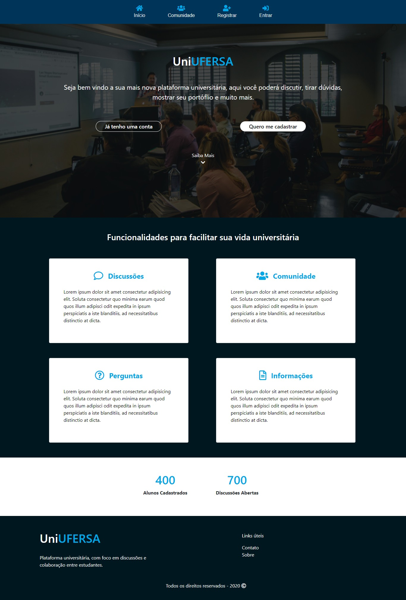
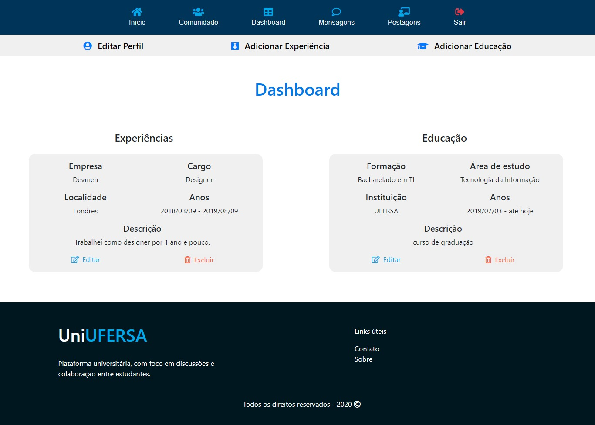
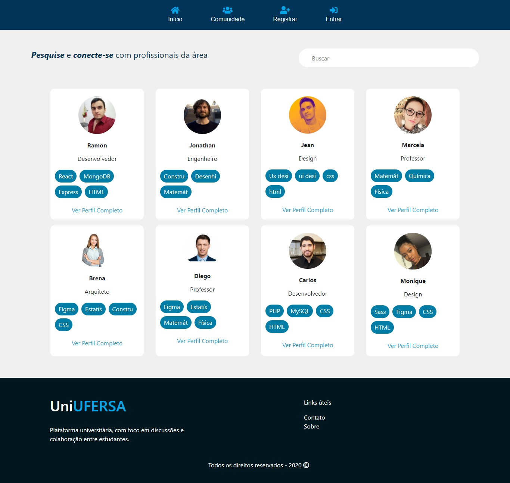
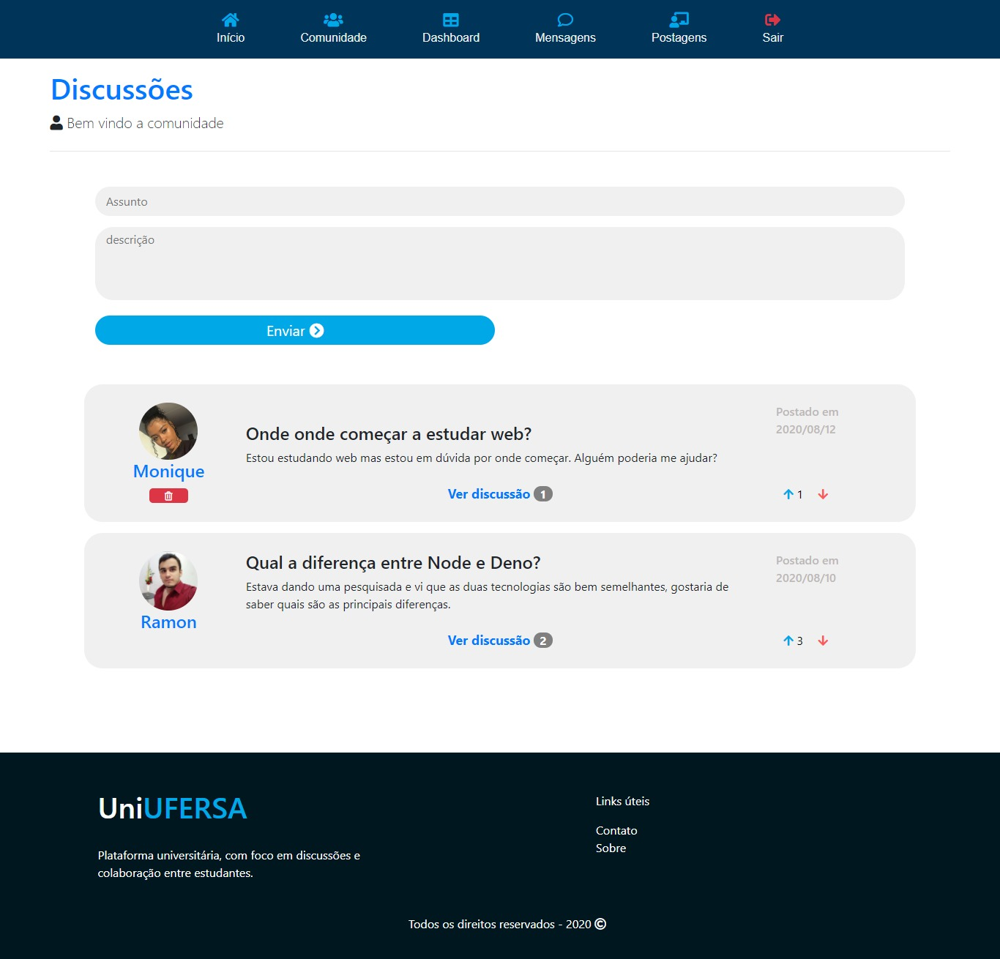
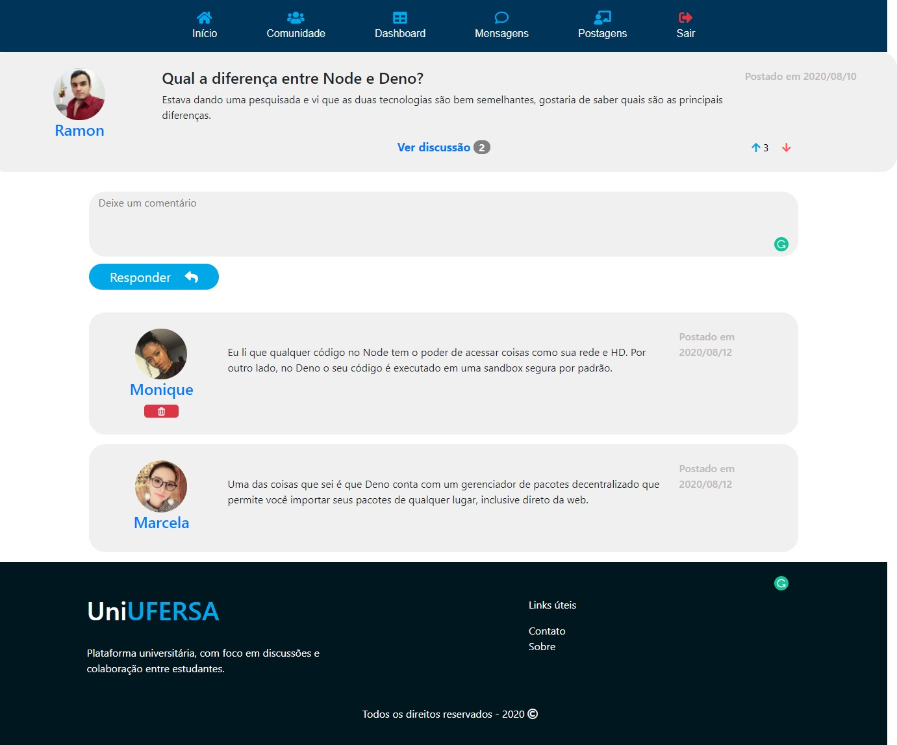

# UniUFERSA

It is a web application built with MERN that tends to connect university students and display their portfolio. Here you will find all kinds of features such as chat, messages, comments, discussions, github projects and much more.

## Main Tools Used

MongoDB, Express, React, Node, Cloudinary, Sass, Redux, Github API, PWA.

## Visual

### HomePage


### Dashboard


### Community


### Profile


### Posts


### Experience Form


### Discussion



## Installation

To run the application you need to have Node and MongoDB(local or cloud database).

You need to run the following command in the main repository and in the client repository.

```bash
npm install
```
## Configuration
You need configurate the files user.js and default.json with your data.

## Contributing
Pull requests are welcome. For major changes, please open an issue first to discuss what you would like to change.


Please make sure to update tests as appropriate.

## Contact me

Feel free to ask me any question, use my email to send me a message.


## License
[MIT](https://choosealicense.com/licenses/mit/)
